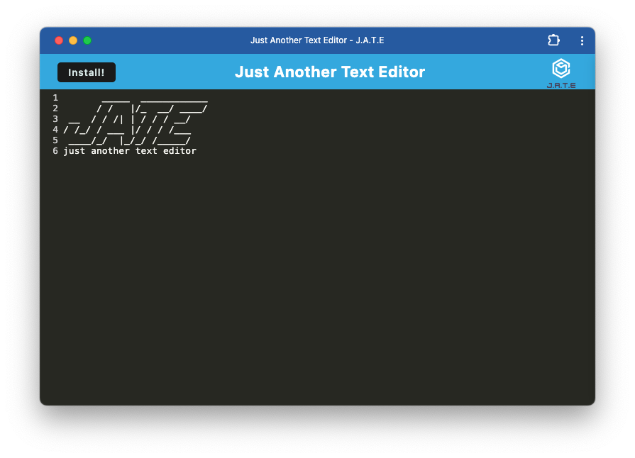

# Progressive Web Applications (PWA) Challenge: Text Editor

## Description
This text editor boasts a robust app built on a single-page application framework, fully compliant with Progressive Web App (PWA) standards. It employs various data persistence techniques to ensure reliability, offering redundancy in case of browser limitations. Notably, the app seamlessly operates offline, enhancing user productivity.

In crafting this innovative text editor, we leverage existing frameworks, enriching them with advanced functionalities. Central to its operation is the utilization of IndexedDB for efficient data retrieval and storage. Leveraging the lightweight idb package, a renowned choice embraced by industry giants like Google and Mozilla, we ensure optimal performance and compatibility across platforms.

## User Story
AS A developer  
I WANT to create notes or code snippets with or without an internet connection  
SO THAT I can reliably retrieve them for later use  

## Acceptance Criteria 
GIVEN a text editor web application   
WHEN I open my application in my editor  
THEN I should see a client server folder structure  
WHEN I run `npm run start` from the root directory  
THEN I find that my application should start up the backend and serve the client  
WHEN I run the text editor application from my terminal  
THEN I find that my JavaScript files have been bundled using webpack  
WHEN I run my webpack plugins  
THEN I find that I have a generated HTML file, service worker, and a manifest file  
WHEN I use next-gen JavaScript in my application  
THEN I find that the text editor still functions in the browser without errors  
WHEN I open the text editor  
THEN I find that IndexedDB has immediately created a database storage  
WHEN I enter content and subsequently click off of the DOM window  
THEN I find that the content in the text editor has been saved with IndexedDB  
WHEN I reopen the text editor after closing it  
THEN I find that the content in the text editor has been retrieved from our IndexedDB  
WHEN I click on the Install button  
THEN I download my web application as an icon on my desktop  
WHEN I load my web application  
THEN I should have a registered service worker using workbox  
WHEN I register a service worker  
THEN I should have my static assets pre cached upon loading along with subsequent pages and static assets  
WHEN I deploy to Render  
THEN I should have proper build scripts for a webpack application  

## Screenshot

Link to deployed app: https://text-editor-pwa-9f1q.onrender.com